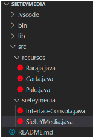
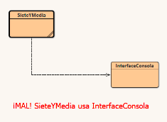
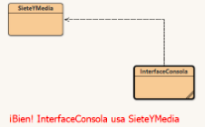

# SieteYmediaRefac

Refactorizar un proyecto existente para que cumpla la arquitectura de dos capas.


## Juego siete y media
Las  siguientes  clases implementan una versión muy reducida del famoso juego de cartas siete y media. En esta versión, hay dos jugadores, el usuario y la banca. La banca es el ordenador (nuestro programa). Respecto al juego original, en esta versión no  hay apuestas y sólo se juega una mano. El funcionamiento concreto se aprecia fácilmente si clonas el repositorio y ejecutas  el programa que incluye al principio una mini explicación.


Observa que la clase GameControler mezcla la lógica de negocio y la lógica de presentación, y por lo tanto,  claramente no cumple el principio de responsabilidad única. 

## SE PIDE
Reestructurar el  proyecto SieteYMedia de forma que:  
- El paquete recursos es el mismo. 
- El paquete sieteymedia es lo que tienes que modificar de forma que haga exactamente lo mismo que Gamecontroler.java pero ahora repartiendo el trabajo y responsabilidad de GameControler en  dos clases:
   - SieteYMedia.java 
   - InterfaceConsola.
     
  Quedando por tanto la App organizada en:
- Capa lógica: clases de paquete recursos y clase SieteYMedia
- Capa de presentacion: clase InterfaceConsola.  Si la E/S fuera más compleja podrían aparecer más clases que colaboraran en la capa presentación, pero quizá sea suficente con una única clase.
 
     


Para conseguir el efecto deseado observa que:
- La aplicación ahora es más compleja, se divide una clase en dos y surgen nuevos métodos necesarios para la comunicación entre ellas. ¿Merece la pena?. Vamos a suponer que sí porque queremos hacer más adelante para este juego su versión gráfica, de esta manera, separando la lógica de la presentación  sólo tendremos que volver a escribir la clase Interface para adecuarla a la nueva entrada/salida pero la clase SieteYMedia no tendremos que tocarla.
- El teclado y la pantalla sólo los maneja InterfaceConsola. ¡ni un println ni un Scanner en SieteYMedia!
- ¿Cómo devuelve los datos SieteYMedia a InterfaceConsola?. Supongamos que InterfaceConsola quiere imprimir las cartas que tiene en un momento dado el Jugador ¿Cómo le pasa SieteYMedia esta información a interfaceConsola?. SieteYMedia puede devolver un simple String para que lo imprima InterfaceConsola o bien una estructura más compleja como un array de cartas. La primera es muy sencilla y clara pero la segunda es más flexible ya que no limita a InterfaceConsola a  imprimir un String concreto. Usa la segunda.
- Debes de crear un objeto SieteYMedia y un objeto InterfaceConsola. Esta pequeña App se puede desarrollar perfectamente sin crear objetos y usando metodos static de clase pero EVITA ESTO ¡estamos aprendiendo POO!. Usar static no es pecado mortal pero su abuso anula los principios de POO (más sobre esto más adelante)
- evita el siguiene error en la relación entre las dos clases.
  
SieteYMedia “usa” InterfaceConsola y esto no es correcto




La flecha de abajo que relaciona las clases se refiere a la relación “usa”. El siguiente gráfico indica que SieteYMedio “usa” InterfaceConsola y justamente esto  SE DEBE EVITAR  para conseguir que la lógica del juego sea independiente de la E/S. Fíjate bien en el sentido de la flecha. 


Si un objeto SieteYMedia invoca a un objeto InterfaceConsola() pasa a ser dependiente de esa clase y no es reutilizable para otras aplicaciones que usen otro tipo de entrada salida.
```java
class SieteYMedia{
	…..
         InterfaceConsola miconsola= new InterfaceConsola()
	…..
        miconsola.presentarJuego() //¡mal!
	……….
          
}
```

peor todavía si usamos métodos static 
```java
class SieteYMedia{
	…..
         InterfaceConsola.presentarJuego(); //mal
         ………….
          
}
```

- evita que SieteYMedia haga funciones de E/S encubiertas
  
Otro error común es que SieteYMedia genere Strings que enmascaran realmente println() de tal forma que InterfaceConsola recibiría unos Strings que puede no desear para comunicarse con el usuario, por ejemplo, se los manda en castellano y los quiere en “Galego” o no le gusta la redacción o lo que sea.
```java
 class SieteYMedia{
	…..
        String presentar(){
	 return ”hola jugador bla bla bla ….”;

        }
        ……….
          
}
class InterfaceConsola{
	…..
       SieteYMedia juego= new SieteYMedia();    
        ……….
       System.out.println(juego.presentar());//¡pero yo no quiero este texto!
      …………
          
}
```

- Por el contrario si InterfaceConsola “usa” SieteYMedia,  es OK
  



Ahora la flecha cambia de sentido de forma que InterfaceConsola “usa” SieteYMedia
```java
class InterfaceConsola{
…………….
SieteYMedia miObjetoSieteYMedia= new SieteYMedia();
………………
System.out.println(miObjetSieteYMedia.valorCartasJugador());
………

}
```
De esta manera podríamos tener muchos clases que desarrollan distintos tipos de interfaces Y que todos utilicen la misma lógica del juego ¡conseguimos reutilizar código!. Para conseguir esto, tienes que tener absolutamente claro que la clase SieteYMedia no puede hacer referencia a ningún tipo de E/S


